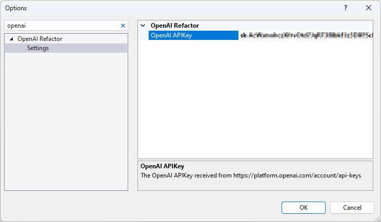
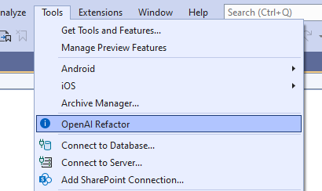

# OpenAIRefactor 
## Visual Studio Extension

### Configuration
- In Visual Studio Tools/Options - search for OpenAI Refactor, and set your API KEY.

### Usage
- Select text in the editor window
-or-
- Based on the cursor position with nothing selected

